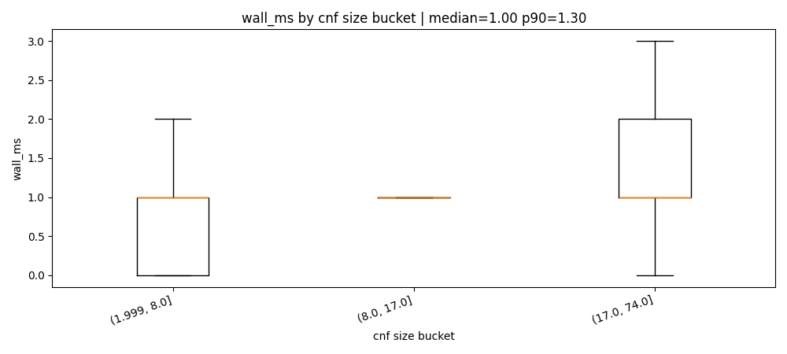
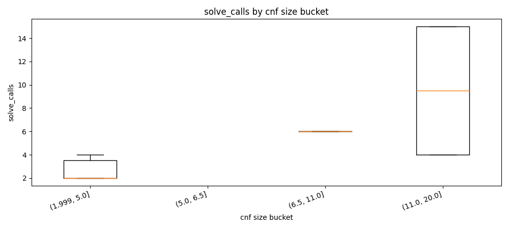
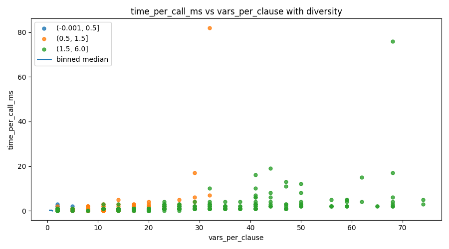

# circuitcount

## Overview

This repository parses `.aag` and `.bench` circuits, builds an AIG, applies cone restriction and simplification, encodes to CNF with Tseitin clauses, and runs projected counting with exact and hash-cell modes. The benchmark artifacts in this repository were generated from `datasets/sample/` and stored in `results/` and `docs/fig/`.

## Build

```bash
cargo build --release
```

```bash
cargo test
```

## Formats

The parser accepts AIGER ASCII with `.aag` extension and BENCH subset with `.bench` extension. The benchmark runner accepts `--format aag`, `--format bench`, and `--format auto`.

## Commands

```bash
cargo run --bin circuitcount -- count "datasets/sample/run15/bench_0003.bench" --out 0 --seed 1 --pivot 4096 --trials 1 --p 0.35 --backend varisat --r 5
```

```bash
cargo run --bin bench_dataset -- --dir "datasets/sample/run15" --out 0 --backend varisat --r 5 --seed 1 --timeout_ms 60000 --csv "results/varisat.csv" --format auto --progress
```

```bash
cargo run --bin bench_dataset -- --dir "datasets/sample/run15" --out 0 --backend dpll --r 5 --seed 1 --timeout_ms 60000 --csv "results/dpll.csv" --format auto --progress
```

```bash
python scripts/gen_sample_dataset.py --out_dir datasets/sample --seed 1 --num_bench 120 --num_aag 120
```

```bash
python scripts/plot_results.py --csv results/results.csv --out_dir docs/fig
```

## Counting output fields

```text
inputs_coi=3 ands=2 vars=6 clauses=8 pivot=4096 trials=1
backend=varisat solve_calls=6 mode=exact result=5 m=0 trials=1 r=5
```

The first line reports cone size and CNF size with pivot and trials. The second line reports backend, solve calls, mode, result, selected `m`, trials, and repeat count.

## Benchmarking a dataset

The benchmark command writes one CSV row per instance with this exact header.

```text
path,status,backend,mode,wall_ms,solve_calls,result,m,trials,r,seed,file_bytes,aig_inputs,aig_ands,cone_inputs,cnf_vars,cnf_clauses
```

This repository includes generated runs in `results/varisat.csv`, `results/dpll.csv`, and merged `results/results.csv`. The merged file is built by keeping one header and appending rows from both backend files.

```text
path=datasets/sample/run15\aag_0000.aag status=ok wall_ms=1 mode=exact result=1
path=datasets/sample/run15\bench_0007.bench status=ok wall_ms=2 mode=exact result=3
rows=15
```

The merged benchmark has 30 instances. The median wall time is 0 ms. The p90 wall time is 1 ms. The median solve_calls value is 4.

## Figures

Definitions of terms used in the figures and report:

**wall_ms.** End-to-end wall clock time in milliseconds for one benchmark run (one circuit, one output index). It is the total time from start of the counting pipeline to finish, including parse, simplify, encode, and all SAT solver invocations.

**solve_calls.** The number of times the counting code calls the SAT solver for that run. The counter enumerates distinct projected solutions by repeatedly solving the CNF, recording the projected assignment, adding a blocking clause that forbids that assignment, and solving again until the formula becomes unsatisfiable or a cap is hit. Each such solve is one "solve call." So solve_calls is the total number of SAT queries issued for that instance.

**CNF size bucket.** The Tseitin encoding turns the simplified AIG into a CNF with some number of variables (`cnf_vars`) and clauses (`cnf_clauses`). A "CNF size bucket" is a range of `cnf_clauses` values used to group instances. The plotting script splits the range of `cnf_clauses` in the dataset into a small number of intervals (e.g. by quantiles) and assigns each row to one bucket. All figures that say "by CNF size bucket" group instances by these intervals so you can see how wall time or solve calls behave as formula size (in clauses) increases.

**time_per_call_ms.** Average milliseconds per SAT call for that run: `wall_ms / max(solve_calls, 1)`. It separates "how many solves" from "how expensive each solve is."

**vars_per_clause.** Ratio `cnf_vars / max(cnf_clauses, 1)`. It characterizes formula shape (variables per clause). Used in one figure to see how this ratio relates to time per call.

**Family.** For BENCH circuits, "family" is inferred from the dominant gate type in the file (e.g. mostly AND, mostly XOR, mostly OR). The script counts AND, OR, XOR, XNOR, NOT, BUF in the bench text and labels the instance by the most frequent op. The family summary figure then groups by this label so you can compare model count time across circuit types.

**p90.** The 90th percentile: the value such that 90% of the data is at or below it. For example p90 wall_ms means 90% of runs had wall time at or below that many milliseconds.

The figures are generated from `results/results.csv`. The script also writes `docs/fig/report.md` with numeric summaries.

```bash
python scripts/plot_results.py --csv results/results.csv --out_dir docs/fig
```

This figure shows **wall_ms** (total run time) grouped by **CNF size bucket** (ranges of `cnf_clauses`). Each bar corresponds to one bucket; the plot highlights how latency changes with formula size and reports median and p90 in the title.



This figure shows **solve_calls** (number of SAT solver invocations per run) grouped by the same **CNF size buckets** as above. More solutions enumerated before UNSAT or cap means more solve calls. 



This figure plots **time_per_call_ms** (average ms per SAT call) against **vars_per_clause** and/or structure (e.g. diversity). It shows how expensive each solve is as a function of formula shape. 




The current report values are dataset_rows=1440, ok_rows=1398, timeout_rows=0, median_wall_ms_ok=1.000, and p90_wall_ms_ok=1.300. The largest size bucket is (8.0, 17.0], with largest_bucket_median_wall_ms_ok=1.000 and largest_bucket_timeout_rate=0.000.

Interpretation from this run is that lag appears in the largest CNF bucket by wall time. Timeout concentration is not present in this sample. The vars-per-clause to time-per-call correlation is positive at 0.041.

## References

Schwartz, Jacob T. Fast probabilistic algorithms for verification of polynomial identities. Journal of the ACM. 1980.

Zippel, Richard. Probabilistic algorithms for sparse polynomials. EUROSAM. 1979.

Fiat, Amos and Shamir, Adi. How to prove yourself: practical solutions to identification and signature problems. CRYPTO. 1986.

Merkle, Ralph C. A digital signature based on a conventional encryption function. CRYPTO. 1987.

Chakraborty, Supratik, Meel, Kuldeep S., and Vardi, Moshe Y. A scalable approximate model counter. CP. 2013.

Chakraborty, Supratik, Meel, Kuldeep S., and Vardi, Moshe Y. Algorithmic improvements in approximate counting for probabilistic inference: from linear to logarithmic SAT calls. IJCAI. 2016.

Soos, Mate and Meel, Kuldeep S. BIRD: engineering an efficient cnf-xor sat solver and its applications to approximate model counting. AAAI. 2019.

Biere, Armin. The AIGER and-inverter graph format version 20071012. FMV Report Series, JKU Linz. 2007.
