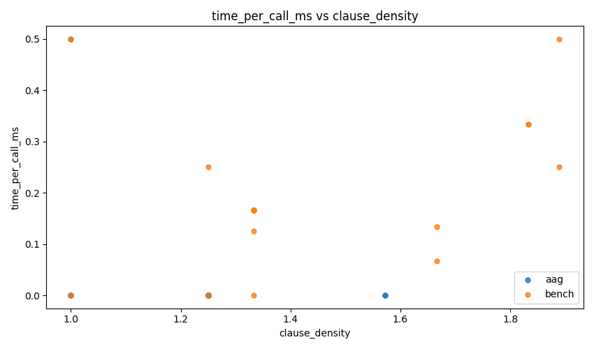
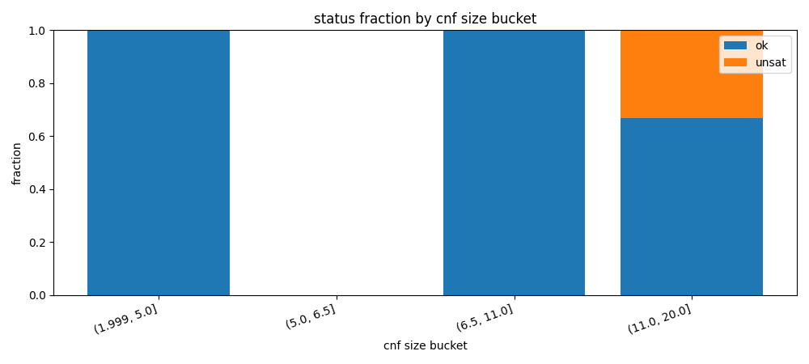
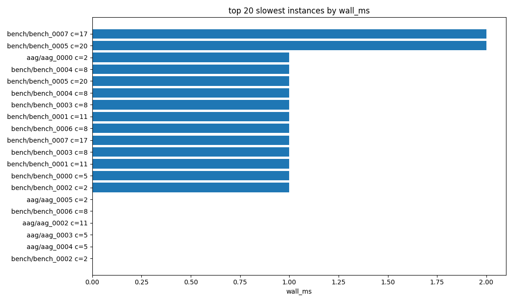
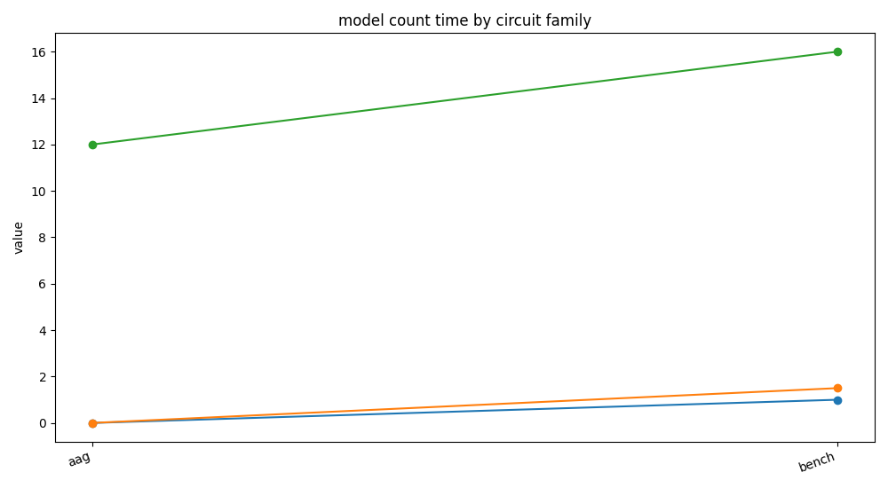
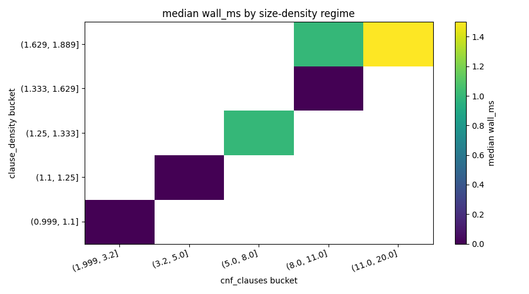

# circuitcount

## Overview

This repository parses `.aag` and `.bench` circuits, builds an AIG, applies cone restriction and simplification, encodes to CNF with Tseitin clauses, and runs projected counting with exact and hash-cell modes. The benchmark artifacts in this repository were generated from `datasets/sample/` and stored in `results/` and `docs/fig/`.

## Build

```bash
cargo build --release
```

```bash
cargo test
```

## Formats

The parser accepts AIGER ASCII with `.aag` extension and BENCH subset with `.bench` extension. The benchmark runner accepts `--format aag`, `--format bench`, and `--format auto`.

## Commands

```bash
cargo run --bin circuitcount -- count "datasets/sample/run15/bench_0003.bench" --out 0 --seed 1 --pivot 4096 --trials 1 --p 0.35 --backend varisat --r 5
```

```bash
cargo run --bin bench_dataset -- --dir "datasets/sample/run15" --out 0 --backend varisat --r 5 --seed 1 --timeout_ms 60000 --csv "results/varisat.csv" --format auto --progress
```

```bash
cargo run --bin bench_dataset -- --dir "datasets/sample/run15" --out 0 --backend dpll --r 5 --seed 1 --timeout_ms 60000 --csv "results/dpll.csv" --format auto --progress
```

```bash
python scripts/gen_sample_dataset.py --out_dir datasets/sample --seed 1 --num_bench 120 --num_aag 120
```

```bash
python scripts/plot_results.py --csv results/results.csv --out_dir docs/fig
```

## Counting output fields

```text
inputs_coi=3 ands=2 vars=6 clauses=8 pivot=4096 trials=1
backend=varisat solve_calls=6 mode=exact result=5 m=0 trials=1 r=5
```

The first line reports cone size and CNF size with pivot and trials. The second line reports backend, solve calls, mode, result, selected `m`, trials, and repeat count.

## Benchmarking a dataset

The benchmark command writes one CSV row per instance with this exact header.

```text
path,status,backend,mode,wall_ms,solve_calls,result,m,trials,r,seed,file_bytes,aig_inputs,aig_ands,cone_inputs,cnf_vars,cnf_clauses
```

This repository includes generated runs in `results/varisat.csv`, `results/dpll.csv`, and merged `results/results.csv`. The merged file is built by keeping one header and appending rows from both backend files.

```text
path=datasets/sample/run15\aag_0000.aag status=ok wall_ms=1 mode=exact result=1
path=datasets/sample/run15\bench_0007.bench status=ok wall_ms=2 mode=exact result=3
rows=15
```

The merged benchmark has 30 instances. The median wall time is 0 ms. The p90 wall time is 1 ms. The median solve_calls value is 4.

## Figures

The figures are generated from `results/results.csv` and `docs/fig/report.md`.

```bash
python scripts/plot_results.py --csv results/results.csv --out_dir docs/fig
```

`docs/fig/time_hist.png` shows wall time by CNF size bucket. This plot answers where lag appears by size regime and reports median and p90 in the title.


`docs/fig/solve_calls_hist.png` shows solve call distribution by the same size buckets. This plot separates oracle intensity from per-call cost.


`docs/fig/time_vs_cnf.png` shows wall time versus CNF clauses with mode coloring and a binned median trend line.


`docs/fig/time_per_call_vs_density.png` shows per-call latency against clause density to highlight expensive solve regions.



`docs/fig/timeout_rate_by_size.png` shows status fractions by size bucket for failure concentration analysis.



`docs/fig/top_slowest.png` shows the slowest instances with family and CNF size labels.



`docs/fig/family_summary.png` shows median and p90 wall time by inferred family for families with at least five rows.



`docs/fig/regime_heatmap.png` shows median wall time over a 2D regime grid of CNF size and clause density.



The report values are dataset_rows=30, ok_rows=28, timeout_rows=0, median_wall_ms_ok=0.500, and p90_wall_ms_ok=1.000. The largest size bucket is (6.5, 11.0], with largest_bucket_median_wall_ms_ok=1.000 and largest_bucket_timeout_rate=0.000.

Interpretation from the report and figures is that lag concentrates in the largest CNF bucket by wall time, timeout concentration is not present in this sample, time_per_call grows with clause_density in the upper-density region, and the aag family has lower median wall time than the bench family on this run.

The required figure paths are `docs/fig/time_hist.png`, `docs/fig/solve_calls_hist.png`, and `docs/fig/time_vs_cnf.png`.

## References

Schwartz, Jacob T. Fast probabilistic algorithms for verification of polynomial identities. Journal of the ACM. 1980.

Zippel, Richard. Probabilistic algorithms for sparse polynomials. EUROSAM. 1979.

Fiat, Amos and Shamir, Adi. How to prove yourself: practical solutions to identification and signature problems. CRYPTO. 1986.

Merkle, Ralph C. A digital signature based on a conventional encryption function. CRYPTO. 1987.

Chakraborty, Supratik, Meel, Kuldeep S., and Vardi, Moshe Y. A scalable approximate model counter. CP. 2013.

Chakraborty, Supratik, Meel, Kuldeep S., and Vardi, Moshe Y. Algorithmic improvements in approximate counting for probabilistic inference: from linear to logarithmic SAT calls. IJCAI. 2016.

Soos, Mate and Meel, Kuldeep S. BIRD: engineering an efficient cnf-xor sat solver and its applications to approximate model counting. AAAI. 2019.

Biere, Armin. The AIGER and-inverter graph format version 20071012. FMV Report Series, JKU Linz. 2007.
